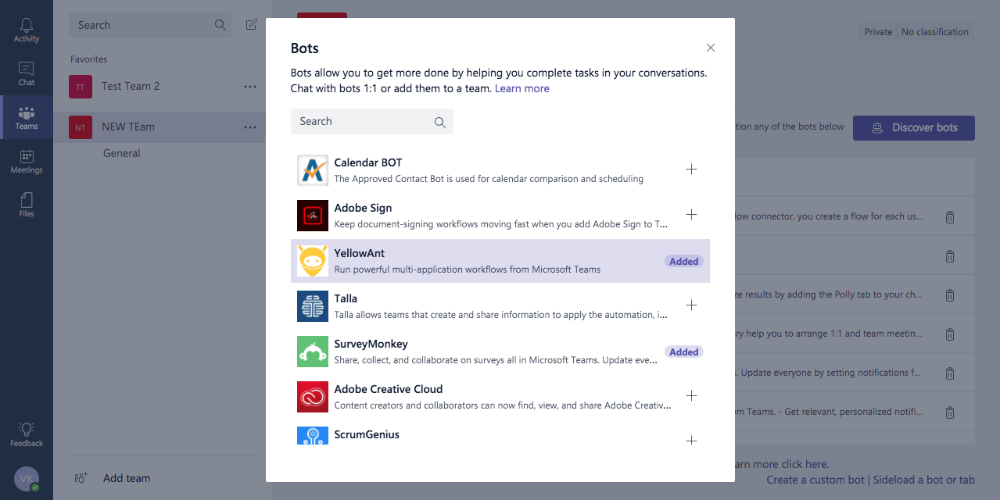
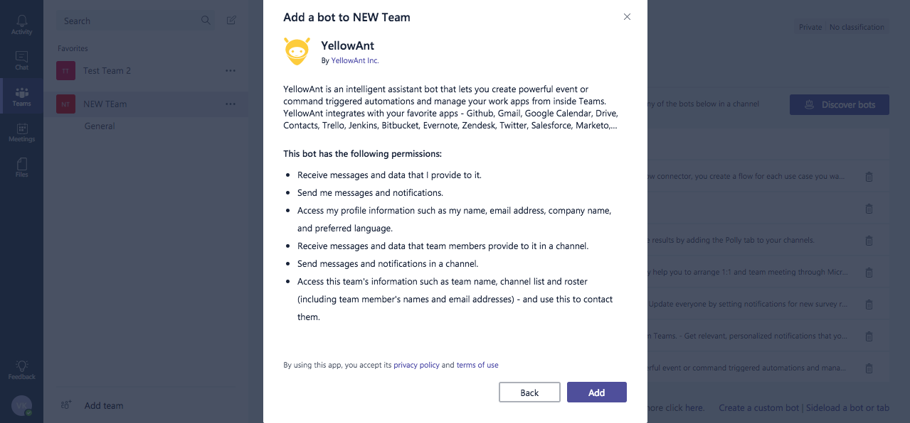
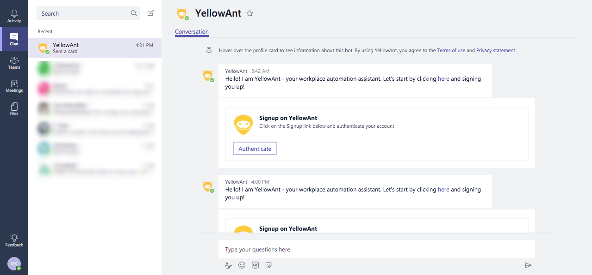
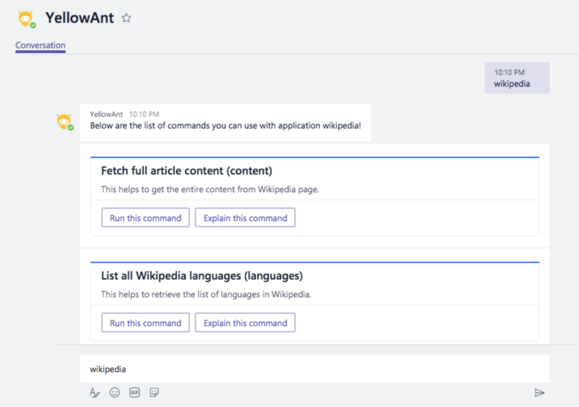
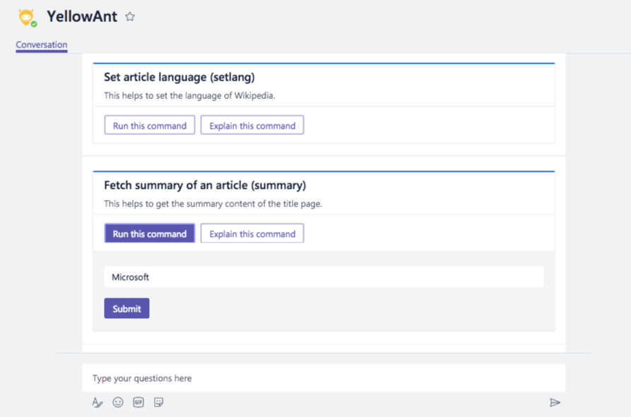
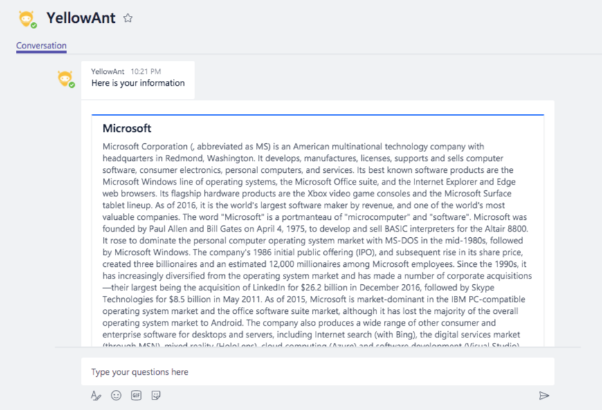

# Signup with MS Teams

Microsoft Teams users can directly import the YellowAnt bot into a team by adding YellowAnt from the Teams bot marketplace. You will be asked to authorize your Azure account, after which YellowAnt will create a team account\(connected to your Office 365 tenant\) with the same domain name as your Azure email domain. If you are the first one from your Office 365 directory to integrate YellowAnt, YellowAnt will make you the owner of the YellowAnt team account - in this case, you will need your Tenant administrator to create an account and transfer the YellowAnt team account.

Let's take a look at the step by step process for signing up using Teams:

1. Let us first add YellowAnt to a team. Go to Microsoft Teams, and click on the \[**...\]** button next to your Team name in the sidebar. \(**Note: **If YellowAnt is already added to a Team, simply go to **Chat sidebar tab, **and search for **YellowAnt **and add it. Start a conversation with YellowAnt by typing **- help.** YellowAnt will send you an authentication message. Go directly to Step 6.\)
2. Click on **Manage Team**
3. Click on the **Bot **tab. In the tab, click on **Discover Bots. **Search for **YellowAnt**, and click on the plus**\(+\) **sign next to the YellowAnt bot.
4. Review the permissions and click on **Add**
5. Once the YellowAnt bot is added to the Team, YellowAnt will send you a personal message asking you to authorize your Azure account.
6. Click on **Authenticate **and authenticate your Azure account
7. You will be taken to the YellowAnt dashboard where you can start integrating applications.
8. Go back to **Microsoft Teams** and you will have received a help message to get you started.
9. Let's take YellowAnt for a spin! YellowAnt comes with three pre-built integrations - Stackexchange, WIkipedia and RSS
   1. Go to **Chats** and click on **YellowAnt.**
   2. Type **wikipedia**
   3. YellowAnt will show you all commands associated with Wikipedia
   4. Under **Fetch summary of article, **click on **Run this command**
   5. YellowAnt will expand the panel and ask for inputs, in this case, the title of the article. Let's put in **Microsoft Teams**
   6. Click on **Submit** to execute the command
   7. YellowAnt will fetch the summary of the title we entered, ie, **Microsoft!**
   8. That is it! This demo is just the tip of the iceberg. You can similarly command from over 35+ applications\(See [Integrating Applications](../integrating-applications/)\), get real time work updates and also create workflows between different applications\(See [Command Workflows](../workflows/command-workflows/) and [Event Workflows](../workflows/event-workflows/)**\) **

