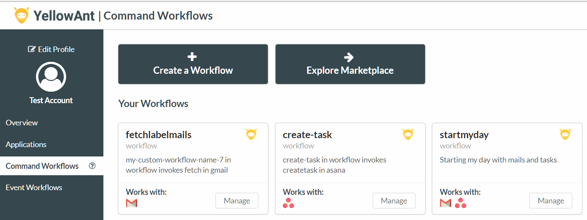
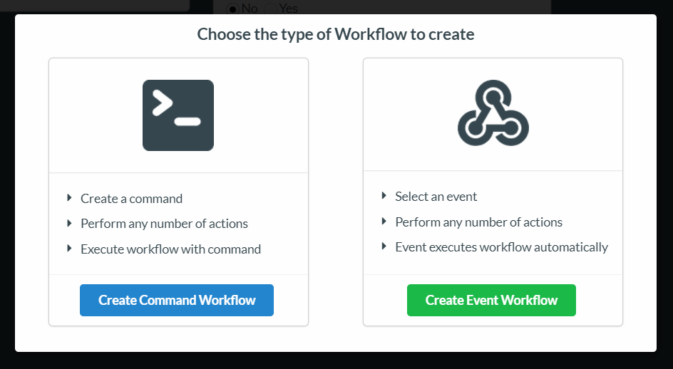
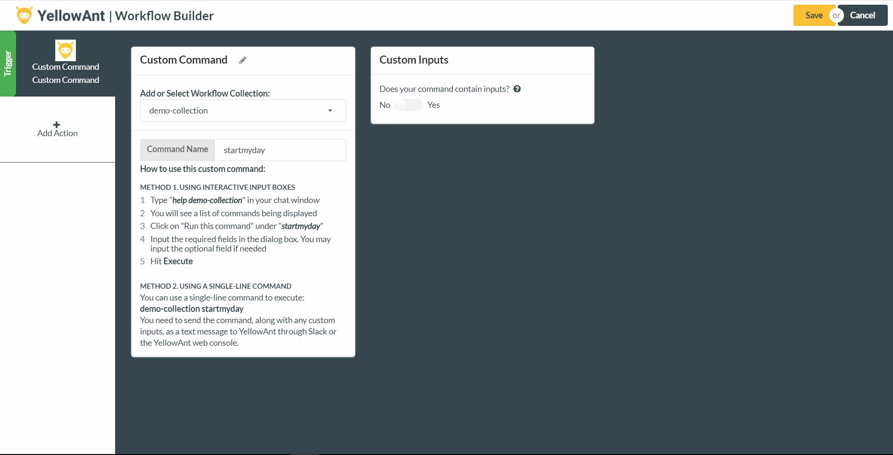
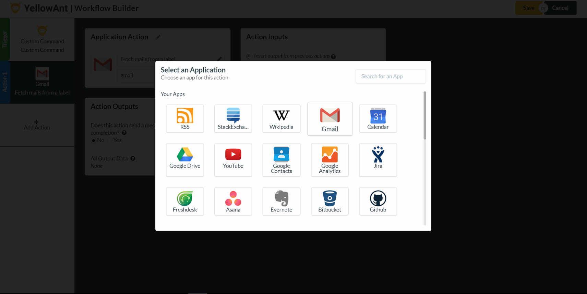
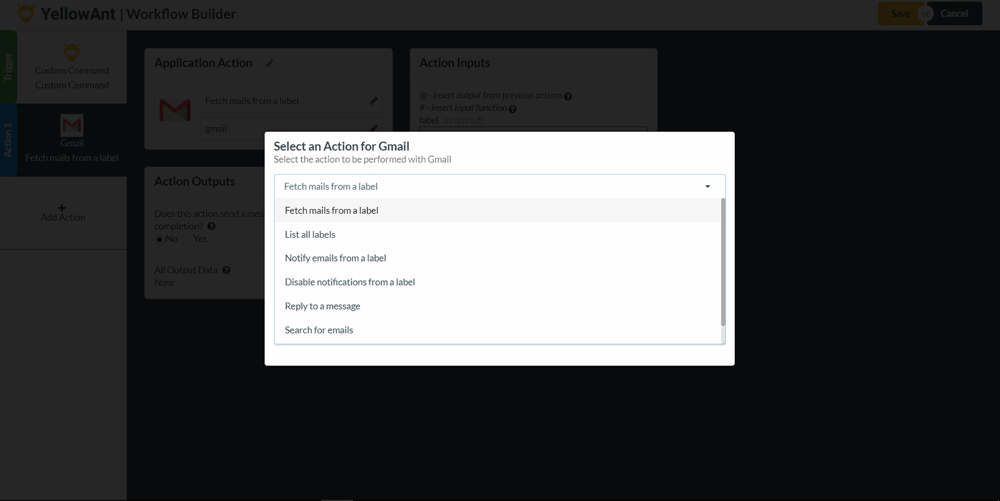
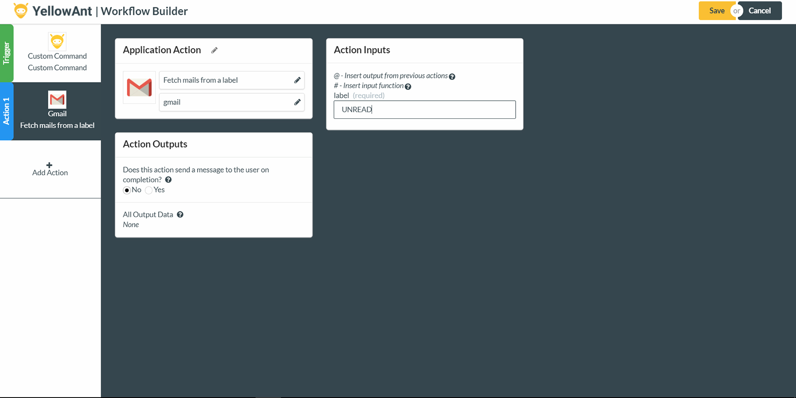
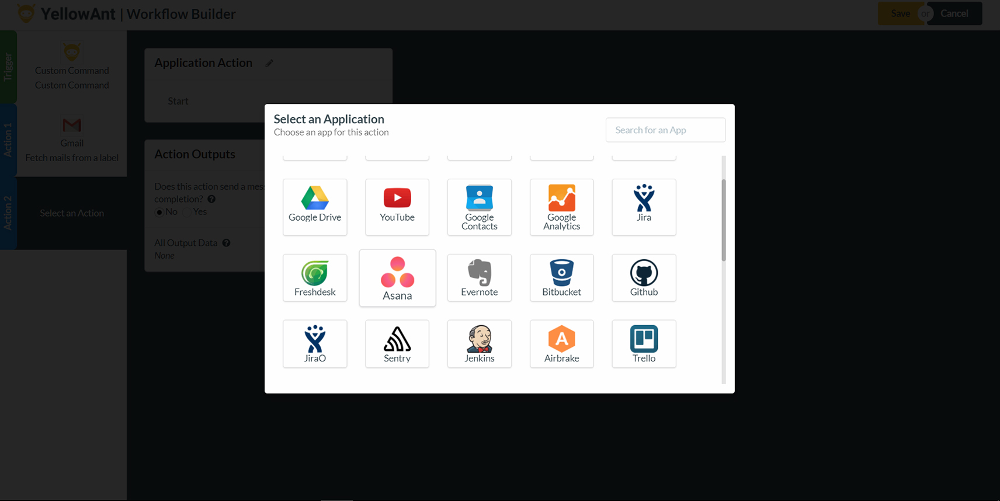
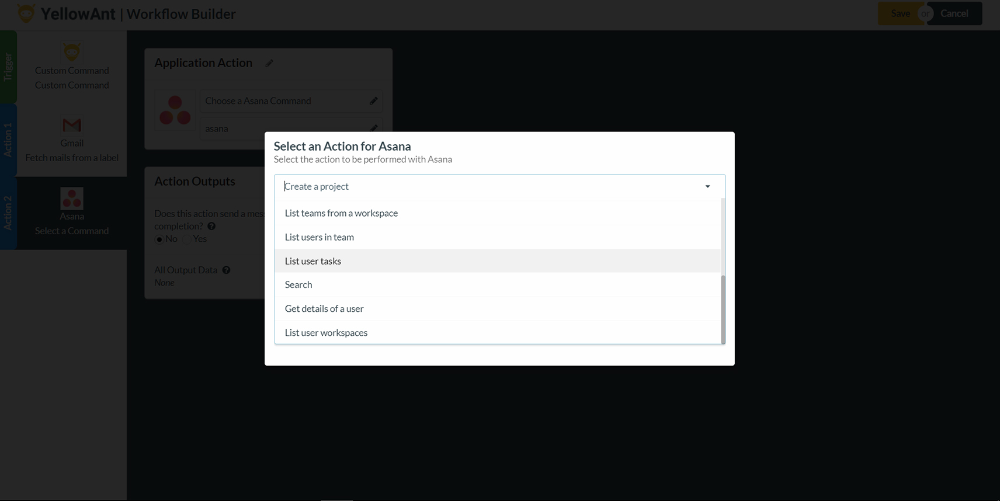
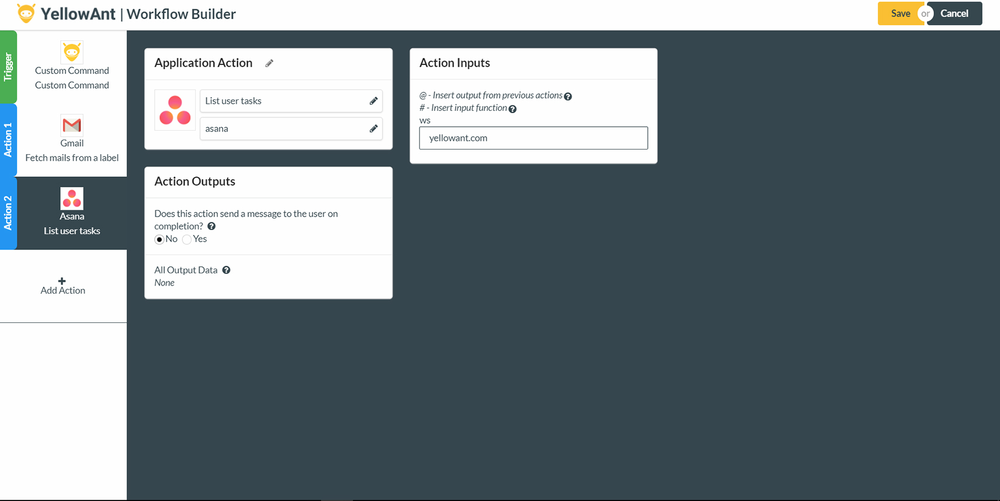
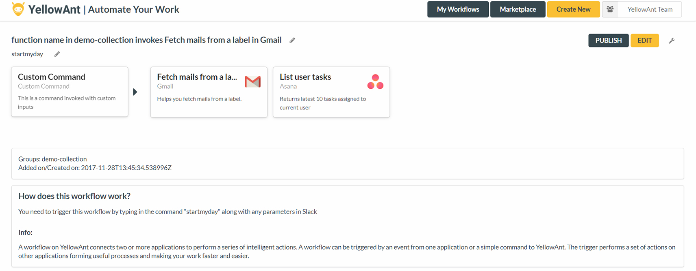

# Building Command Workflows

In this section, we see step by step how to create a command workflow on YellowAnt. Following which, we will also cover a very common scenario as the example.

1. In your YellowAnt Dashboard, either from the Overview Panel or Command Workflows Panel, select "Add New" or "Create a Workflow" option respectively. 

   

2. This will take you to the "Workflow Builder" page. Select "Create Command Workflow" from the two choices. 
3. Choose a "Collection" in which you want to add the workflow to, Then, give a command name to the workflow. This will be useful in executing the command later from your chat window. Example, we are naming it "startmyday" and in order to execute it later, we would be using the command "workflow startmyday".

   Note: A collection is a way of segregating workflows into sets in order to keep them more organized for every individual. This is totally up to the user and can be treated as having different set of workflows where each set forms a collection with some specific set of tasks. Watch out for custom collections for different domains which will soon launch on YellowAnt.  
   

4. Click on "Add Action in the left panel.
5. Choose the application from which you want to use as your first "Action". Here, we select "GMail". 
6. Choose the action you want from to use from the application. Here, we select "fetch mails from a label". 
7. Fill in the required parameter field with the values you need. Here, we want mails fetched with the label "UNREAD". 
8. Click on "Add Action" in the left panel to add the second application.
9. Choose the application from which you want to use as your second "Action". Here, we select "Asana". 
10. Choose the action you want from to use from the application. Here, we select "List user tasks". 
11. Fill in the required parameter field with the values you need. Here, we want tasks fetched from a workspace "yellowant.com". 
12. You can continue to create a chain of events across many apps. We will save it here. Click the button "Save" in the top panel. 
13. You will get a notification in your chat window about the creation of this new workflow. You can execute it right from there as well. 
14. To execute it at any point, just type "collectionname workflowname" and it executes. Example, "demo-collection startmyname". 

## Another Example \(more comprehensive\):

Let’s create one Slack command that gets a high-priority PagerDuty incident, creates a JIRA issue, sends an email to the Test team, and creates a calendar event for a war room meeting. Normally, this process would take atleast 5 minutes. With this command, it will take 5 seconds.

Let’s begin,

1. In the YellowAnt console, click on “Create a Workflow”. 

2. Click on **Create New**

3. Select **Command-based Workflow**

In the Trigger area, select your custom command name. In this case, we have given _**war-room.**_ Our custom command will now start with **war-room**

In the **Input arguments** section, define the arguments\(or variables\) that this command will take. 

4. Click on **Add a new input argument.** In this case, the arguments will be **id**\(Id of the PagerDuty incident\).

It is now time to add some actions.

Our first action will be to search for the PagerDuty incident with Id **‘id**’. Our second action will be to create a JIRA ticket from the data that PagerDuty incident command returns.

5. Click on **Add Action.**

6. Select **PagerDuty**.

_Fetching incident details_

7. In the actions, select **get\_incident**

_Fetching the incident details from PagerDuty_

The get\_incident command takes one argument, i.e the **incident\_number.** This corresponds to the **id** that we will pass in the argument. 

8. Click on the **incident\_number** textbox and type **@ .**This will bring a dropdown of all the available variable that we will pass in our command. Select **id**.

The next action is to create a JIRA ticket. 

9. Click on **Add Action** and select **JIRA.** In the actions dropdown, select **createissue.**

The PagerDuty **get\_incident** command gives us a bunch of data to use to create a new JIRA ticket. Use the **@** symbol to select the variable in the inputs. You can use multiple variables within one input box — YellowAnt automatically concatenates them into one string.

_Creating a JIRA ticket from Pagerduty data_

It’s time to send a mail to the testing team

10. Click on **Add Action.** Select **GMail.** In the function list, select **send.**

_Creating an Email from Pagerduty data_

11. Format your **subject** and **message** using the **@** symbol to get data from the PagerDuty command.

It’s now time to call a war room meeting using Google Calendar.

12. Click on **Add Action.** Select **Google Calendar.** In the function list, select **create.**

Describe the event name — you can add some data from the previous steps using the **@** symbol. The **event** variable takes the event description in natural language. So you can say something like — **war room meeting for PD escalation @incident\_number in the next 5 minutes.**

_Creating a Google Calendar event_

13. Click on **Save.**

