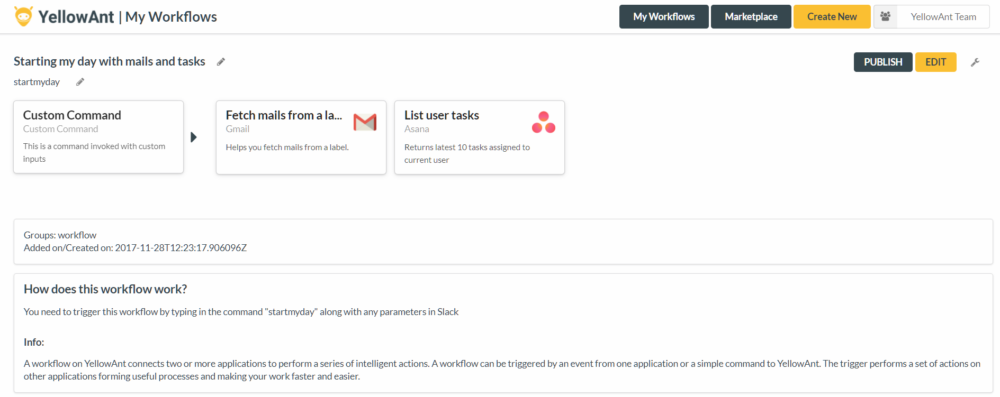

# Using Templates

## Workflow Templates

Workflow templates are pre-made workflows that you can find in the YellowAnt Workflows Marketplace. These workflows are built by:

* YellowAnt Team: Our team is constantly churning out new templates which we feel would be useful to our users. In the marketplace, you will also find collections which are sets of useful workflows bundled together. 
* YellowAnt Users: Users of YellowAnt also build workflows and can publish it for others to use as well. When publishing the right to use them can be limited to either just their team or make it available to the entire community of YellowAnt users. 

Steps to start using an existing template:

1. Go to the Workflow Marketplace. You can either go directly from the overview panels of the dashboard or either of the workflow panels in the dashboard. 

2. In the overview panel, under event or command workflows, click on "View All".  

3. In the Command Workflows panel, click on "Explore Marketplace"  

4. In the Event Workflows panel, click on "Explore Marketplace"

5. You will be taken to the workflows page where you can select to either view your workflows or "Explore Marketplace".  

6. You can now view all the available templates. You can also apply application filters to find specific combinations of applications working together in applications.  

7. Click on "Use Template" for whichever workflow you want to start using. It gives you an overview of what the workflow does.  

8. Click on "Use Template" to view it in the builder. You can edit values as needed by you and hit "Save" and it will create a copy of the workflow for you with any updated details that you may have.  

9. After that, it's a regular workflow in your account and you can use it the way you like. It does not impact the template in any way.

## Publishing your Templates

Any YellowAnt can also publish their workflows for their team or anyone in the YellowAnt users community to use. Once you have created the workflow, all you have to do is hit "Publish" in the view and it gets published.

